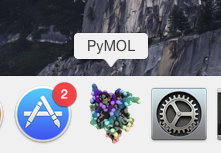
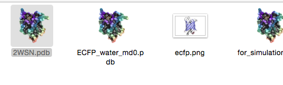
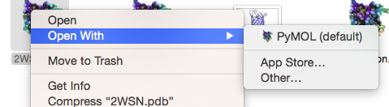

# PyMOL.app


This repository is stand for providing a Mac OS X application container for [PyMOL][] which is installed by [homebrew][].
While [homebrew][] version (X11 version) does not have `PyMOL.app`, the following useful features were disabled:

- Start a PyMOL by double clicking a PyMOL icon
- Open PDB files (or any kind of files which PyMOL supports) in PyMOL by double clicking

However, with `PyMOL.app` in this repository, you will get the features above as like as other native Mac OS X applications.


[PyMOL]: http://http://pymol.org/
[homebrew]: https://github.com/Homebrew/homebrew


## How to install it.

First of all, make sure your PyMOL is correctly installed in your system via [homebrew][].
If you PyMOL is correctly installed, the following command will show up PyMOL.

```
$ /usr/local/bin/pymol
```


Otherwise you have to install PyMOL via [homebrew][]:

```
$ brew tap homebrew/dupes
$ brew install homebrew/dupes/tcl-tk --with-threads --with-x11
$ brew install python --with-brewed-tk
$ brew install pymol
```

Then [download this repository](https://github.com/lambdalisue/macosx-pymol-app/archive/master.zip) and copy `PyMOL.app` (you may just see `PyMOL` instead) to your Application directory.

While this application is not signed, you need to press `Option` key to open this application at the first time (See http://www.imore.com/how-open-apps-unidentified-developer-os-x-mountain-lion for more detail).

Note:

You may need to wait the [PR#41728](https://github.com/Homebrew/homebrew/pull/41728) to be merged while Python of [homebrew][] does not correctly install tcl-tk. Or you can `brew edit python` to edit your `Python.rb` for instance (check my [`Python.rb`](https://github.com/lambdalisue/homebrew/commit/f92604b590ef1801682584aa79571e0492101660) which I used to install in Yosemite).

## Screenshots

  
PyMOL on Dock


  
PDB files in Finder

  
"Open With" of PDB files

License
-------------------------------------------------------------------------------
The MIT License (MIT)

Copyright (c) 2015 Alisue, hashnote.net

Permission is hereby granted, free of charge, to any person obtaining a copy
of this software and associated documentation files (the "Software"), to deal
in the Software without restriction, including without limitation the rights
to use, copy, modify, merge, publish, distribute, sublicense, and/or sell
copies of the Software, and to permit persons to whom the Software is
furnished to do so, subject to the following conditions:

The above copyright notice and this permission notice shall be included in
all copies or substantial portions of the Software.

THE SOFTWARE IS PROVIDED "AS IS", WITHOUT WARRANTY OF ANY KIND, EXPRESS OR
IMPLIED, INCLUDING BUT NOT LIMITED TO THE WARRANTIES OF MERCHANTABILITY,
FITNESS FOR A PARTICULAR PURPOSE AND NONINFRINGEMENT. IN NO EVENT SHALL THE
AUTHORS OR COPYRIGHT HOLDERS BE LIABLE FOR ANY CLAIM, DAMAGES OR OTHER
LIABILITY, WHETHER IN AN ACTION OF CONTRACT, TORT OR OTHERWISE, ARISING FROM,
OUT OF OR IN CONNECTION WITH THE SOFTWARE OR THE USE OR OTHER DEALINGS IN
THE SOFTWARE.
